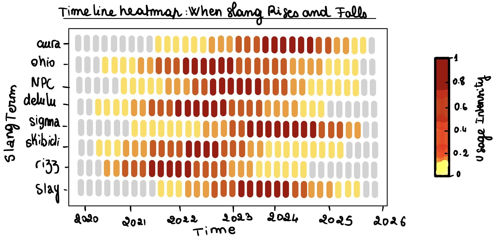
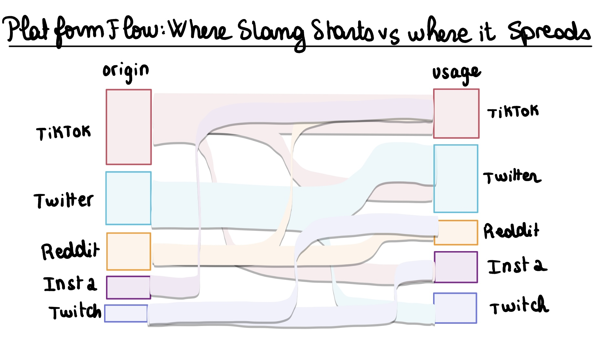
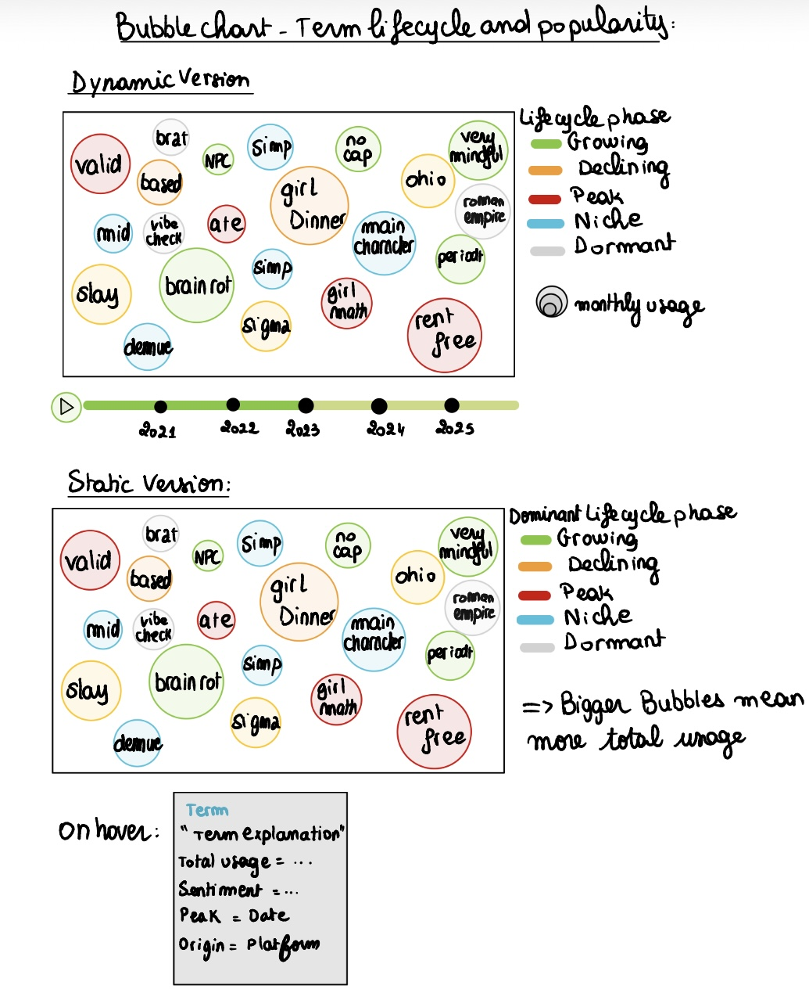
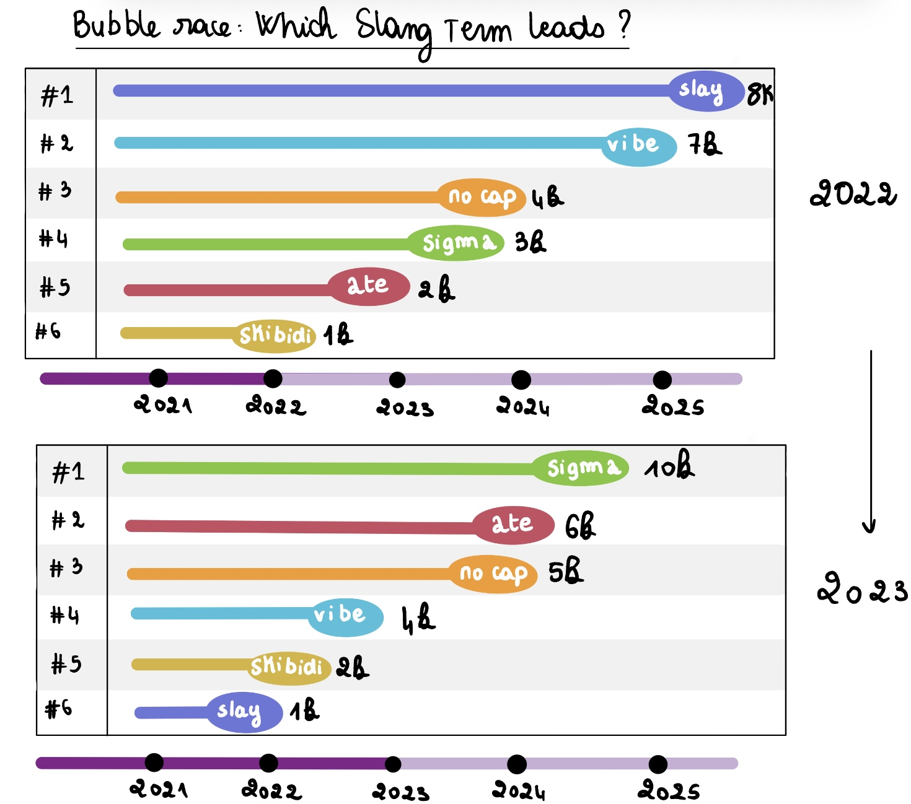
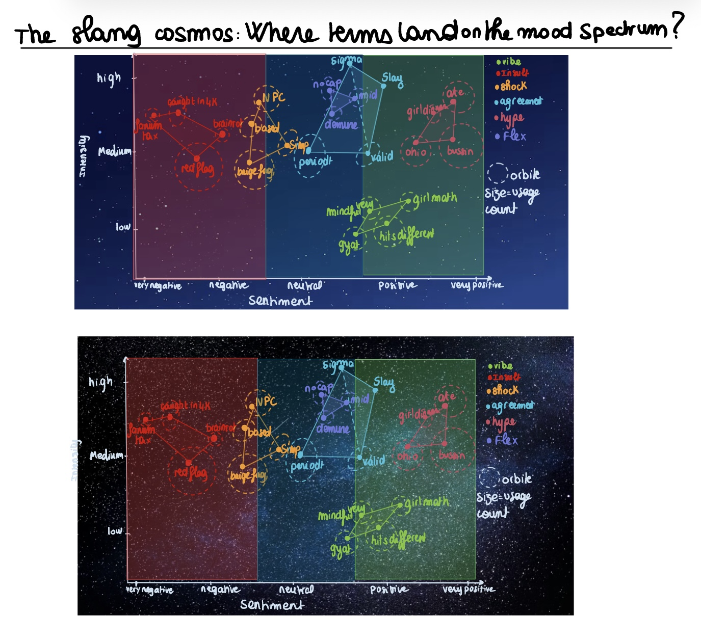
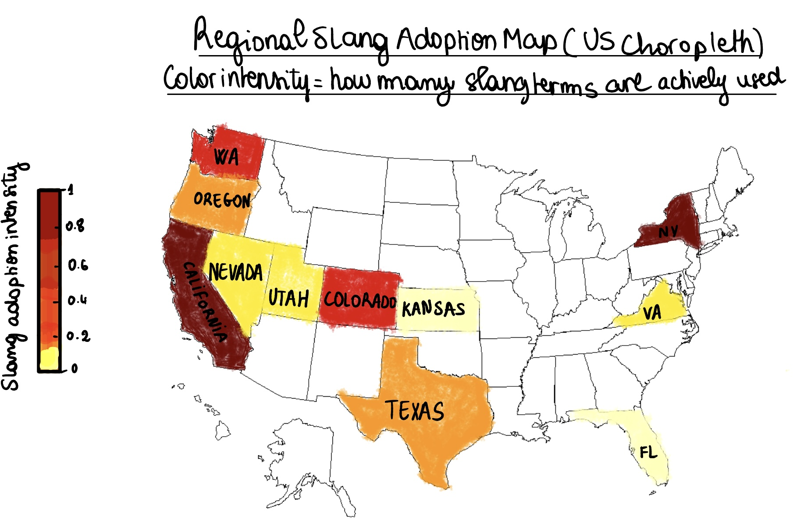

# Project of Data Visualization (COM-480)

| Student's name | SCIPER |
| -------------- | ------ |
|Rania Boubrik | 361496|
|Maryam Harakat | 359826|
|Rosa Mayila | 275047|
|Valentin Planes | 409205|

[Milestone 1](#milestone-1) • [Milestone 2](#milestone-2) • [Milestone 3](#milestone-3)

## Milestone 1 (20th March, 5pm)

**10% of the final grade**

This is a preliminary milestone to let you set up goals for your final project and assess the feasibility of your ideas.
Please, fill the following sections about your project.

*(max. 2000 characters per section)*

### Dataset
For our project, we chose the **GenZ Slang Evolution Tracker (2020–2025)** dataset from Kaggle (https://www.kaggle.com/datasets/likithagedipudi/genz-slang-evolution-tracker-2020-2025). This dataset follows "GenZ" slang terms across social media and includes information that can help us understand not only which words are popular, but also how they move through online culture over time.

The dataset is based on a topic that people immediately understand. Instead of working with something too technical or abstract. Therefore, it  worked perfectly for us as we wanted a dataset that could lead to a visual story people would actually want to look at, instead of something too technical or abstract. 

The dataset feels like a good match for a data visualization project as it is organized and vast enough to show interesting patterns. It contains a number of rows and columns to explore. The variables include the slang term itself, timestamp, term category, meaning, origin platform, usage platform, region, user age group, usage context, lifecycle phase, sentiment, irony, likes, shares, comments, virality score, and days since emergence. That is useful because it gives us different types of information at once. Some columns describe the language itself, some describe the social media environment, and others measure attention and engagement. Because of that, the dataset is not limited to one question. It gives us several angles for analysis, such as time, geography, platform culture, and popularity.


### Problematic

This project is an interactive visualization about how Gen Z slang evolves and spreads across various platforms. The idea is to show that slang is not fixed: a term can appear on one platform, become popular very quickly, spread to other platforms, and then slowly disappear or lose attention. So instead of treating it as just a list of trendy words, our main motivation is to present it as something dynamic that follows its own lifecycle. The visualization will make these changes easier to see by connecting slang to time, platforms, and visibility.

Internet slang is everywhere, especially on platforms used by younger people, but its evolution is usually not shown in a clear visual way. It is interesting because slang lets us see how online trends are born, spread across platforms, and fade, which says a lot about how digital culture works. We liked the idea of working on something connected to online culture while still using a structured dataset that allows us to build a real visual story. The topic is also accessible, which makes our target audience fairly broad. We imagine this visualization being understandable for students, young adults, and more generally anyone interested in internet culture, social media, or digital trends. We do not want to make something only for experts. The goal is to create something visually clear enough so that even someone with no background in data visualization can understand the main message.

At the center of the project is the following question: How does Gen Z slang evolve and spread across social media platforms between 2020 and 2025?
From that, the main axis of the visualization becomes clear: the evolution of slang over time and across platforms.

### Exploratory Data Analysis
Our first exploratory data analysis started with a preprocessing step to check whether the dataset needed cleaning before visualization. After loading the CSV file, we found that it contains 535,396 rows and 22 columns. We then checked for missing values and found that all columns contain 0 missing values. We also checked for duplicate rows and found 0 duplicates. This shows that the dataset is already very clean, so we do not need heavy preprocessing before starting the analysis.

Even if the dataset does not have missing values or duplicates, some preparation was still necessary. For example, the timestamp column was stored as text, so it should be converted into a real datetime format before making visualizations based on time. Some other columns, such as origin_platform or lifecycle_phase should also be treated as categorical variables. This will make the analysis more consistent and the visualizations easier to build.
Moreover, the descriptive statistics already give some useful insights. The dataset contains 46 unique slang terms and 22 regions, which suggests enough variety to compare different trends. 

The numerical variables also show interesting patterns. In particular, the maximum values for likes, shares, and comments are much higher than their median values, which suggests that the dataset includes some highly viral observations. This means that engagement is probably very uneven, with a small number of cases receiving much more attention than the rest. That is something we will need to keep in mind when designing the final visualizations.

Overall, the dataset is both clean and rich in information.In our case, preprocessing is mainly about formatting and organizing the data rather than correcting major errors. The results mentioned in this section come directly from our exploratory notebook.


### Related work
There is already some work related to this dataset on Kaggle. It is especially in the form of exploratory notebooks, which usually focus on the first analytical steps, such as loading the dataset, checking the variables, looking at distributions, and creating a few basic charts. That kind of work is useful for us because it confirms that the dataset is workable and that it contains enough variety for interesting analysis. At the same time, it also shows the limit of basic exploration. If we only produce standard summary plots, our project would not really stand out.

What we want to do differently is focus more on the story behind the data by presenting it as a timeline of emergence, spread, popularity, and decline. In other words, we want to use the dataset to explain a dynamic process. That gives the project a more original angle, because it turns the analysis into a narrative about how online language changes inside different digital spaces. We are especially interested in showing movement between origin platform and usage platform, because that feels like one of the most meaningful parts of the dataset.

For inspiration, we are thinking less about copying one exact example and more about the general style of data stories that are easy to explore and understand. Since our topic is internet slang, we think the final project should feel accessible, visually clear, and maybe even a little playful. We do not want something overloaded with technical details that makes people lose interest immediately.So the originality of our project comes mainly from the way we want to frame the data, which is not just as descriptive statistics, but as a visual story about how language trends move through social media culture. 

Here are a couple visualizations that we found interesting and that we think might correspond to our objective:


## Milestone 2 (17th April, 5pm)

**10% of the final grade**

### Project Goal & Narrative Arc

Our project, **GenZvision**, is an interactive scrollytelling visualization that answers the question: *How does Gen Z slang evolve and spread across social media platforms between 2020 and 2025?*

Rather than presenting slang as a static list of trendy words, we treat it as a **dynamic phenomenon with a lifecycle**: emergence, growth, peak, decline, and dormancy. The visualization guides the user through four narrative chapters, each powered by a distinct D3.js visualization:

1. **The Rise** — A timeline heatmap reveals when each slang term enters the cultural lexicon and how its usage intensity fluctuates month by month across 2020–2025, using a YlOrRd sequential colormap.
2. **The Spread** — A Sankey diagram maps the cross-platform diffusion of slang, showing how terms originate on one platform (predominantly TikTok) and migrate to others like Twitter, Reddit, Instagram, and Twitch.
3. **Peak & Decline** — A dynamic bubble chart plots each term's lifecycle phase. Color encodes the current phase (growing, peak, declining, dormant) and bubble size encodes the monthly usage count, both animated over time so the user can watch terms rise and fall.
4. **Explore** — An interactive dashboard section (Milestone 3) will allow users to filter by term, platform, age group, and region with coordinated, linked views.

**Target audience:** Students, young adults, and anyone interested in internet culture — accessible and visually engaging, not overly technical.

### Visualization Sketches

Below are hand-drawn sketches of the visualizations we plan to build for the final product:

**1. Timeline Heatmap — When Slang Rises and Falls**

Each row is a slang term, each column is a month, and color intensity (YlOrRd) encodes usage intensity. The heatmap lets you spot at a glance when a term peaked and how long it stayed relevant.



**2. Platform Flow — Where Slang Starts vs. Where It Spreads (Sankey Diagram)**

Left nodes represent origin platforms, right nodes represent usage platforms. The width of each flow encodes the number of terms that traveled that path. This reveals cross-platform diffusion patterns — e.g., terms born on TikTok spreading to Twitter and Reddit.



**3. Bubble Chart — Term Lifecycle and Popularity (Dynamic + Static Views)**

The sketch shows two versions: a **dynamic view** where bubble color (lifecycle phase) and size (monthly usage count) animate over time using a timeline slider, and a **static view** showing the final state. On hover, a tooltip reveals the term's explanation, total usage, sentiment, phase, date, origin, and platform.



**4. Bubble Race — Which Slang Term Leads?**

Inspired by bar chart races, terms compete in lanes ranked by popularity. As the user drags a timeline slider (or presses play), terms overtake each other — "slay" dominates in 2022 but "sigma" surges to #1 by 2023. Each term has a colored trail showing momentum.



**5. The Slang Cosmos — Sentiment × Intensity Constellation Map**

A scatter plot where X = sentiment score (-1 to +1) and Y = intensity score (0 to 1). Terms in the same category are connected by lines to form "constellations." The chart uses a dark sky background with glowing stars. This dual encoding reveals that sentiment and intensity are independent dimensions (correlation ≈ 0.01): a term like "brat" can be mildly negative yet used with extreme intensity.



**6. Regional Slang Adoption Map (US Choropleth)**

A US map where color intensity encodes how many slang terms are actively used in each state. The dataset covers 12 US states and 10 international regions (66% US, 34% international by occurrence). California and New York show the highest adoption.



### Tools & Lectures

| Visualization | Tools | Specific Lecture Content Used |
|---|---|---|
| **Scrollytelling layout** | HTML/CSS, JavaScript | **L1 / Intro (Web Dev):** use JavaScript to add interaction and dynamic behaviour to the page. **L12 (Storytelling):** narrative structure, a clear and fairly linear flow for stronger storytelling, starting with an interesting point, and limiting interactivity to key elements. |
| **Timeline heatmap** | D3.js v7 (scales, axes, color scales) | **L5.2 (Interactive D3):** use D3 scales to map a data domain to a visual range, D3 axes for readable labels, and the margin convention so labels and ticks are not cramped. **L6.1 (Perception & Color):** use a sequential colour scale with proportional change in lightness and hue, and avoid perceptually uneven palettes such as Matlab jet. **L6.2 (Marks & Channels):** use position for the time axis and luminance / saturation for intensity, while following the expressiveness principle so the encoding matches the data. |
| **Platform Sankey** | D3.js + d3-sankey | **L8 (Maps):** flow / Sankey-style representations can show movement or transfer using line width and colour. **L5.1 (Interactions):** brushing for selecting a subset of items and linking for showing how that subset behaves in other views, which fits cross-platform filtering. **L7.1 (Designing Viz):** Nested model level 3 — choosing the visual encoding and interaction idiom; task abstraction for comparing multiple targets when reading platform flows. |
| **Bubble chart (dynamic)** | D3.js (force simulation, transitions) | **L5.2 (Interactive D3):** D3 transitions, easing functions, and keyed data joins / update patterns for stable animated updates. **L10 (Graphs):** force-directed layouts, adapted from physics, with nodes repelling each other and links acting like springs. **L6.2 (Marks & Channels):** size encodes monthly usage and hue encodes lifecycle phase, combining two independent visual channels. **L12 (Storytelling):** animation helps put changing values in context over time. |
| **Bubble race** | D3.js (transitions, ranked layout) | **L5.2 (Interactive D3):** animated transitions for smooth changes in monthly ranking over time. **L12 (Storytelling):** start with a strong entry point and use the changing order to guide the viewer through the story. **L6.2 (Marks & Channels):** position encodes rank, size encodes magnitude, and hue distinguishes each term. |
| **Constellation map** | D3.js (scatter, force, annotations) | **L10 (Graphs):** node-link diagrams, where terms are nodes and relationships between them define the links. **L6.1 (Perception & Color):** use a categorical palette with a limited number of clearly distinguishable hues for constellation categories. **L6.2 (Marks & Channels):** position encodes two quantitative variables, size encodes a third, and the expressiveness principle keeps the encoding tied to the data only. |
| **Interactive explore** | D3.js + Crossfilter | **L5.1 (Interactions):** Shneiderman’s visual information-seeking mantra — overview first, zoom and filter, details on demand — plus linked views and small multiples. **L5.2 (Interactive D3):** Crossfilter for fast multidimensional filtering in coordinated views, and D3 event handlers for interactive controls. **L7.2 (Do’s and Don’ts):** maximize data density, avoid pie charts, and follow bar-chart guidelines such as horizontal labels, a zero baseline, and consistent colour use. |
| **Word cloud (hero)** | D3-cloud | **L9 (Text Viz):** tag clouds can work as a first-pass query tool for identifying the main words, but they also come with a clear design tradeoff because size and position are hard to read precisely. The lecture also points to adjective–noun pairs as a richer way of representing text. |
| **Regional choropleth** | D3-geo, TopoJSON | **L8 (Maps):** choropleth maps shade regions in proportion to an attribute; projection choice matters because it affects area, distance, shape, direction, and scale; and mapped values should be normalised for population density rather than shown as raw totals. |

**Cross-cutting design principles:**
- **L7.1 (Designing Viz)**: Problem-driven (top-down) design using the 4 nested levels (domain situation, data abstraction, visual encoding, algorithm); wireframing and sketching before implementation; deployment on GitHub Pages.
- **L7.2 (Do's and Don'ts)**: Tufte's integrity principles — "show data variation, not design variation"; graphical integrity (consistent intervals, start at 0); maximize data-ink ratio.
- **L6.1 (Perception & Color)**: Preattentive processing features for visual popout; Gestalt grouping principles (proximity, similarity); categorical color palettes limited to 6–8 hues.

### Independent Pieces & MVP Breakdown

**Core MVP (must deliver):**

These are the essential visualizations that together tell the complete story of Gen Z slang evolution. Dropping any of these would leave a gap in the narrative.

1. **Scrollytelling website** — Section navigation with scroll-triggered transitions using Intersection Observer API. Each section reveals the next chapter of the story (Rise → Spread → Peak & Decline → Explore). This is the backbone that ties all visualizations into a coherent narrative.
2. **Timeline heatmap** — Rows = slang terms, columns = months (2020–2025), color = usage intensity (YlOrRd sequential colormap). Answers: *"When did each term peak?"* Interactive tooltips on hover show exact month, count, and sentiment per cell.
3. **Platform Sankey diagram** — Origin platforms on the left, usage platforms on the right, flow width = number of term occurrences traveling that path. Answers: *"Where does slang start and where does it spread?"* Hover highlights individual flows with details.
4. **Bubble chart with lifecycle phases** — Each bubble = a slang term. Color = lifecycle phase (green/growing, red/peak, orange/declining, gray/dormant), size = monthly usage count. Both channels animate over time via a timeline slider. Answers: *"How do terms rise and fall?"* Hover tooltip shows term meaning, origin, sentiment, and phase.
5. **Interactive tooltips on every visualization** — At minimum, hovering any data element reveals detailed information. This follows Shneiderman's "details on demand" principle.
6. **Animated word cloud hero section** — Floating slang terms using D3 force simulation as the landing page visual. Terms drift and collide gently, creating an organic first impression before the user scrolls into the data story.
7. **Responsive layout** — Desktop-first design that adapts gracefully to different screen sizes.

**Stretch goals (enhance but could be dropped without endangering project meaning):**

These add depth, creativity, and polish. Each is independent and can be implemented in any order.

1. **Bubble race chart** — Bar-chart-race style animation where slang terms compete in ranked lanes over time. A play button and timeline slider let the user watch terms overtake each other (e.g., "sigma" surging from #4 to #1). This adds a gamified, engaging dimension to the temporal story.
2. **Sentiment constellation map ("The Slang Cosmos")** — A scatter plot with X = sentiment, Y = intensity, size = usage. Terms in the same category are connected into constellations on a dark sky background. This reveals that sentiment and intensity are independent (r ≈ 0.01) — a term can be mildly negative yet used with extreme passion.
3. **Regional US choropleth** — A D3-geo map colored by slang adoption intensity per state. The dataset covers 12 US states and 10 international regions (66% US, 34% international by occurrence). A dropdown could filter by specific term to see geographic spread.
4. **Sentiment ridgeline plot** — Overlapping density curves (one per slang category) showing the full sentiment distribution, not just averages. The gradient fill transitions from red (negative) through purple (neutral) to green (positive). This is the most aesthetically striking way to show sentiment patterns.
5. **Cross-view filtering via Crossfilter** — Selecting a term in one visualization highlights it in all others. Brushing a time range on the heatmap filters the Sankey and bubble chart simultaneously. This transforms isolated charts into a unified analytical tool.
6. **Gen Z-themed micro-interactions** — Glassmorphism card tooltips, neon glow effects, pill-shaped filter buttons, slang-inspired copy ("hold up bestie..." instead of "Loading..."), hover animations with glow rings and spring easing. These design choices make the website feel native to Gen Z culture rather than a generic dashboard.


### Functional Prototype

Our working prototype is in the `website/` directory. To run locally:

```bash
cd website
python -m http.server 8080
# Open http://localhost:8080
```

The prototype includes:
- A hero section with floating slang terms (D3 force simulation)
- An interactive timeline heatmap with tooltips (fully functional)
- A Sankey diagram showing platform flows (fully functional)
- A bubble chart showing term lifecycles (fully functional)
- Placeholder cards for the Explore section (Milestone 3)


## Milestone 3 (29th May, 5pm)

**80% of the final grade**


## Late policy

- < 24h: 80% of the grade for the milestone
- < 48h: 70% of the grade for the milestone
